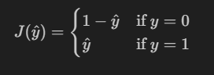

# Logistic Regression

## Where do we use it?

- used in **Classification** problems _(True/False)_
- modifies linear regression to handle edge cases better
- uses **Sigmoid Function** to squash the edges of linear regression line (modification)
- use of sigmoid results in an **'S'** shaped curve

> Shall forever and ever be in debt of [Machine learning Geek](https://machinelearninggeek.com/) for this image, will lay my life down for them

## Mathematics behind this

### 1. Sigmoid Function

- gives probability that the the input is 1

  - if p(z) < 0.5 then model predicts 0
  - if p(z) > 0.5 then model predicts 1

- The curve of the functtion has its y intercept = 0.5

- mathematically denoted by 
  $$ŷ = \frac{1}{1 + e^{-z}}$$
  > here z = w\*x + b for our logistic regression ŷ (prediction)

### 2. Cost function

- $$J(w, b) = J(ŷ) = - \frac{1}{m} \sum\ \left( y^{(i)} \cdot \log(\hat{y}^{(i)}) + (1 - y^{(i)}) \cdot \log(1 - \hat{y}^{(i)}) \right)$$

- How did we obtain this?

  - We see from observation that the function should behave in the following manner:

    

  - Thus combining these two conditions, we get an equivalent function: 
    $$j(\hat{y}) = (1-\hat{y}^{(1-y)}) \cdot \hat{y}^{(y)}$$

  - Taking a log on both the sides to put a cap on value and calculations, we get: 
    $$J(\hat{y}) =\left( y^{(i)} \cdot \log(\hat{y}^{(i)}) + (1 - y^{(i)}) \cdot \log(1 - \hat{y}^{(i)}) \right)$$

### 3. Gradient

- Gradient of J wrt w:   $$\frac{\Delta J(w, b)}{\Delta w} = \frac{1}{m} \sum X \cdot (y - \hat{y})$$

- Gradient of J wrt b:   $$\frac{\Delta J(w, b)}{\Delta b} = \frac{1}{m} \sum (y - \hat{y})$$

### 4. Gradient descent

- Gradient descent for weight: 
  $$w = w - \alpha \cdot \frac{\Delta J(w, b)}{\Delta w}$$
- Gradient descent for bias: 
  $$b = b - \alpha \cdot \frac{\Delta J(w, b)}{\Delta w}$$
